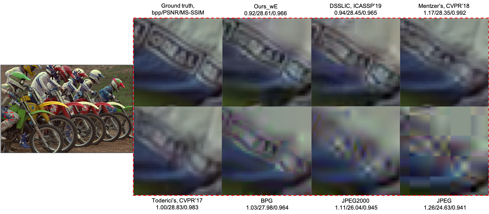
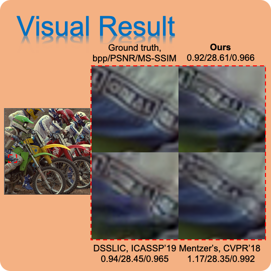
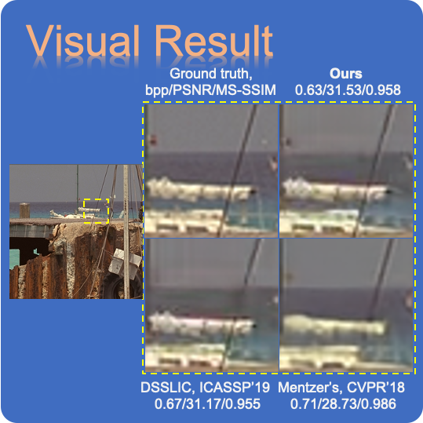
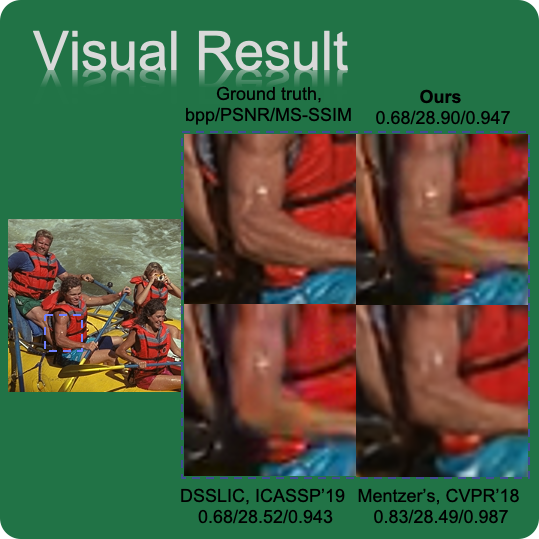
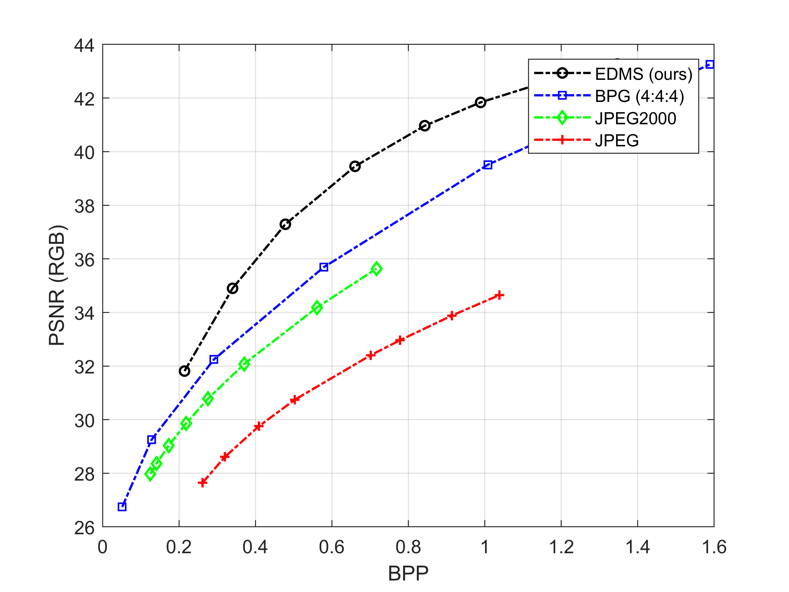
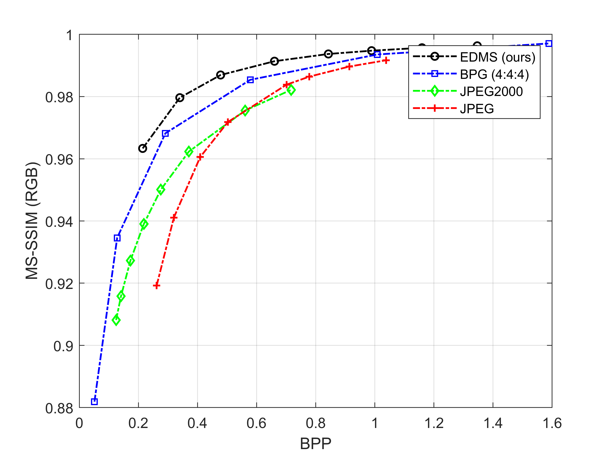

# Image Compression with Encoder-Decoder Matched Semantic Segmentation
[Paper](10.1109/CVPRW50498.2020.00088)

[Trinh Man Hoang](https://www.facebook.com/manhoang.trinh/),
[Jinjia Zhou](https://www.zhou-lab.info/jinjia-zhou)

2020 IEEE/CVF Conference on Computer Vision and Pattern Recognition Workshops (CVPRW), Seattle, WA, USA, 2020, pp. 619-623

The code is built on [DSSLIC](https://github.com/makbari7/DSSLIC) & [PSPNet](https://github.com/CSAILVision/semantic-segmentation-pytorch)

  

### Table of Contents
1. [Requirements and Dependencies](#requirements-and-dependencies)
1. [Testing Pre-trained Models](#testing-pre-trained-models)
1. [Citation](#citation)

  

### Requirements and Dependencies
- Ubuntu 16.04.5 LTS
- Python 3.6.8
- Cuda & Cudnn (We test with Cuda = 10.0 and Cudnn = 7.6.5)
- PyTorch 1.3.0
- MATLAB R2018b

### Testing Pre-trained Models

  
  
  

Download pretrained models from https://drive.google.com/drive/folders/1lDUPbsYKiBZnCthhKADqwmo2jvop5avz?usp=sharing and put them into the collated folders.

Perform the encoder-decoder matched compression:

    $ python test.py --dataroot </path/to/your/imageFolder/> --label_nc 151 --resize_or_crop none --batchSize 1 --gpu_ids 0 --checkpoints_dir checkpoints/ --results_dir </results/path/> --sMapWeights_path ./checkpoints/SMap_epoch_149.pth --fmt png

Download "Binary BPG distribution for Windows (64 bit only)" from https://bellard.org/bpg and put all the binary files in the folder ./evaluation code/bpg-win64

Download "FLIF Encoder" from https://github.com/FLIF-hub/FLIF and put all the installed binary files in folder ./evaluation code/FLIF-master

Then perform the residual and down-sampled version compression by using MATLAB and run ./evaluation code/main.m

  
  

### Citation
If you find the code useful in your research, please cite:

  @INPROCEEDINGS{9150905,
    author={T. M. {Hoang} and J. {Zhou} and Y. {Fan}},
    booktitle={2020 IEEE/CVF Conference on Computer Vision and Pattern Recognition Workshops (CVPRW)},
    title={Image Compression with Encoder-Decoder Matched Semantic Segmentation},
    year={2020},
    volume={},
    number={},
    pages={619-623},
    doi={10.1109/CVPRW50498.2020.00088}
  }

### Contact
[Trinh Man Hoang](mailto:hoangtrinh1001@gmail.com)

### License
This repository (as well as its materials) is for non-commercial uses and research purposes only.
